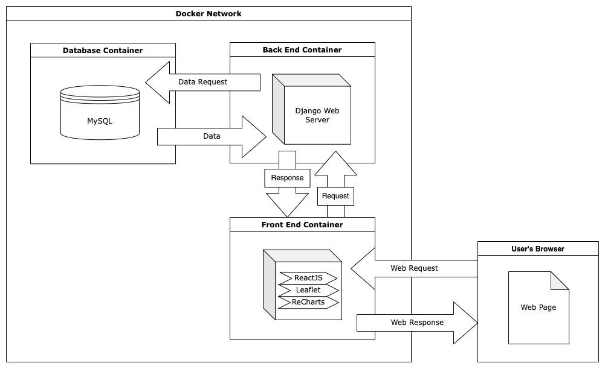

# FPA-FOD-Plus Website

</img>
</img>

## Team: Fires Wild

### Members:

- David Adams
- Benjamin Collins
- Brenden Marks
- Jeremy Stocking
- Samuel Wasko

# Architectural Diagram

</img>

# Prereqs

- Docker (recommend docker desktop)
  - docker-compose
- Python 3
- MySQL

# Project Health

# Build & Run

## Clean install (or clean refresh)

When you make changes to the project, you will need to re-build the docker containers before your changes will be reflected in the docker project.

From the root project directory:

- `$ docker-compose down`
  - this will stop the currently running insance of the project. This will not delete associated app volumes.
    - if you would like to delete the volumes (INCLUDING THE DB AND ALL DATA), you may add the `-v` paramter.

- `./build.sh`
  - this will re-build the context and run the docker stack detached from the console

## Troubleshooting

- Django container error: `django.db.utils.OperationalError: (2003, "Can't connect to MySQL server on 'ffp-mysql' ([Errno 111] Connection refused)")`
  - The mysql container is not usually initialized the first time before the django container tries to access it. to solve this, you can restart just the django container in Docker desktop, or try running `$ docker-compose down` (NO `-v`) then `$ docker-compose up`. This can also be accomplished by stopping the Django container and restarting it using Docker Desktop.

## Importing Data

### Automatically

- To import data as csv (please note the .csv file MUST be located in the /sql/ folder):
    `./csv-data-import.sh <name-of-csv-file>.csv`

- To import sample sql statements
    `./sample-data-import.sh`

### Manually

Below are the manual steps to import data into the sql container. Failing to follow the following steps can prevent data from being successfully imported. 

- Build and run the docker container outlned in the Clean install section of this README

- First: Upload create table statement and csv file into the sql container:
  - `$ docker cp ./sql/createtable.sql ffp-mysql:./var/lib/mysql-files/`
  
- This next step requires you to upload our data. There are two ways of doing so. We have a small, 250 sample insert statement script, then we have a CSV file we will import our data from. The small insert statement script is intended to be used for testing, while importing from a CSV is meant more for production. 

  - To import the insert statements, copy the insert statement SQL script with the following command:
    - `$ docker cp ./sql/sample_create_insert_statements.sql ffp-mysql:./var/lib/mysql-files/`
    
  - To import our data from a CSV file, use the following copy script:
    - `$ docker cp ./sql/[csv_name].csv ffp-mysql:./var/lib/mysql-files/`
  
- Second: Enter the mySQL CLI and login as the root user (This can be done in Docker Desktop)
  - `$ mysql -u root -p -h localhost`
  - Enter the password when prompted

- Use existing database created by docker-compose file:
  - `USE ffp-mysql-db`
 
- Run the create table script
  - `mysql> source /var/lib/mysql-files/createtable.sql`
  
- Import data from the CSV file OR run insert statement script

  - To import using our SQL script, run the following command:
    - `mysql> source /var/lib/mysql-files/sample_create_insert_statements.sql`
  
  - To import the data from the CSV file
    - `mysql> LOAD DATA INFILE '/var/lib/mysql-files/[csv_name].csv' IGNORE INTO TABLE [table_name] FIELDS TERMINATED BY ',' OPTIONALLY ENCLOSED BY '"' LINES TERMINATED BY '\n' IGNORE 1 LINES SET CONT_DATE = date_format(str_to_date(CONT_DATE, '%m/%d/%Y %T'), '%Y-%m-%d %T');`
    - A message showing number of records created, deleted, or skipped will show when done.
    - `SHOW WARNINGS;` can be done to show any warnings generated
  
- Troubleshooting
  - You may need to restart the ffp-django container to establish connection to the database
  - If you can't run the `LOAD DATA INFILE` command, try running `mysql> SELECT @@GLOBAL.secure_file_priv;` command and try again.

# Attributions:

- [Django MySQL Docker Sample - Sergei Konik](https://skonik.me/setup-django-with-mysql-using/)
- [Fire Emoji - Wikimedia Commons](https://commons.wikimedia.org/wiki/File:Noto_Emoji_KitKat_1f525.svg)
- [Unutterable Font](https://fontesk.com/unutterable-font/)
