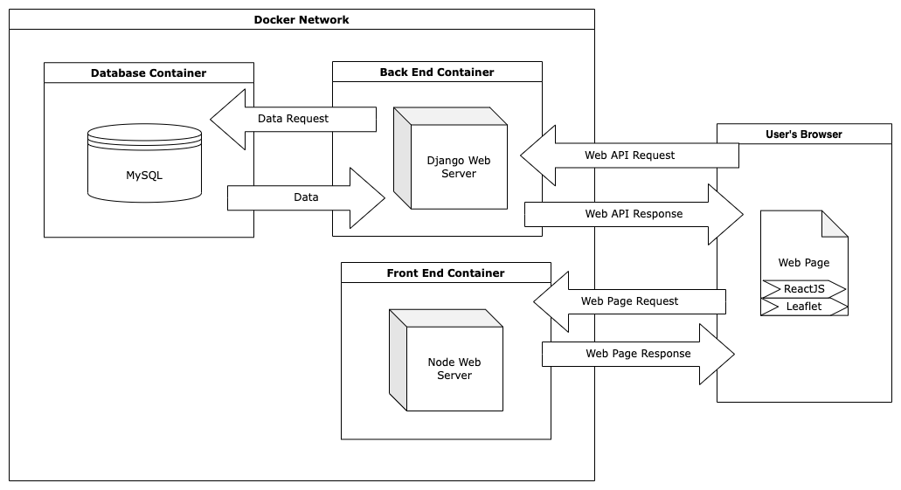

# capstone-template
BSU CS481 Capstone project template

# Architectural Diagram
</img>

# Prereqs
- Docker (recommend docker desktop)
    - docker-compose
- Python 3
- MySQL

# Build & Run
## Clean install (or clean refresh)
From the root project directory:
- `$ docker-compose down -v`
    - this will kill any currently running instances of this project and DELETE their associated volumes
    - this is neccesary because as mysql configuration changes, it will not be reflected until volumes are removed and re-created
- `$ docker-compose build`
    - this will build the project
    - output from this command contains information useful for debugging
- `$ docker-compose up`
    - this will start the project
    - NOTE: This will likely produce errors, as the mysql container is not usually initialized the first time before the django container tries to access it. to solve this, you can restart just the django container in Docker desktop, or try running `$ docker-compose down` (NO `-v`) then `$ docker-compose up`
- You should now see the containers running in docker, and be able to access the website from localhost.

# Sources Used:
[Django MySQL Docker Sample - Sergei Konik](https://skonik.me/setup-django-with-mysql-using/)